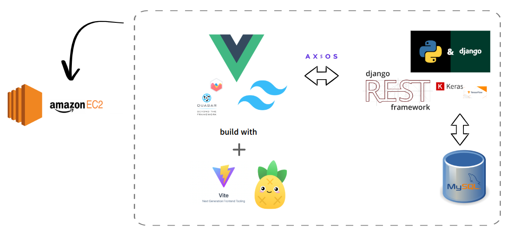

# ***MoneyMate***

- **배포 URL**: [15.165.215.136:5173](http://15.165.215.136:5173)  
- **테스트 계정 정보**:  
  - **아이디**: test  
  - **비밀번호**: 123456a!

---

## 0. ***설치 및 실행 방법***

1. **프로젝트 클론 및 종속성 설치**
   ```
   git clone https://lab.ssafy.com/joker901010/pjt-10.git
   cd final-pjt-front
   npm install
   cd final-pjt-back
   pip install -r requirements.txt
   python manage.py investment_styles
   python manage.py exchange
   
   ```

2. **백엔드 서버 실행**
    ```
    python manage.py runserver
    ```

3. **프론트엔드 서버 실행**
   ```
   npm run dev
   ```

4. **접속**
   - 브라우저에서 http://localhost:5173 로 접속


## I. ***프로젝트 소개***

**MoneyMate**는 사용자들이 금융 상품을 쉽고 효과적으로 비교하고, 투자 결정을 도울 수 있도록 다양한 기능을 제공합니다.  
주요 서비스는 다음과 같습니다:

1. **금리 비교 및 시각화**:  
   - 코스피, 코스닥, 금시세를 차트로 시각화하여 3개월의 변화 제공.
   - 적금 및 예금 금리를 그래프로 시각화하여 직관적으로 비교 가능.  
   - 기간별 필터(6개월, 12개월, 24개월, 36개월)를 통해 맞춤형 금리 정보 제공.

2. **금융 상품 추천**:  
   - 설문 기반 투자 성향 분석 후 개인 맞춤형 금융 상품 추천.

3. **커뮤니티 기능**:  
   - 금융 관련 정보를 공유할 수 있는 글 작성 및 댓글 기능 제공.

4. **챗봇 서비스**:  
   - ChatGPT 기반의 챗봇을 통해 금융 관련 질문에 실시간 답변 제공.

5. **주식 데이터 예측**:  
   - LSTM 기반 머신러닝 모델을 사용하여 3개월 미래 주식 종가 예측.

6. **환율 계산기**:  
   - 금융위원회 API를 활용한 실시간 환율 계산.

---

## II. ***팀원 정보 및 업무 분담 내역***

| 팀원       | 담당 업무                                                                 |
|------------|---------------------------------------------------------------------------|
| **정주하** | 프로젝트 설계, 딥러닝 모델 개발, 데이터 매핑, API 통합 및 백엔드 구축      |
| **이영재** | 데이터 필터링, 프론트엔드 UI/UX 개발, CORS/CSRF 문제 해결 및 배포 관리     |

---

## III. ***설계 내용(아키텍처 등)***

### **아키텍처 개요**

MoneyMate는 **클라이언트-서버 구조**로 설계된 웹 애플리케이션입니다. 주요 기술 스택은 다음과 같습니다:

1. **프론트엔드**:
   - Vue 3 및 Tailwind CSS를 사용한 사용자 친화적 UI/UX 구현.
   - Vite를 활용하여 빌드 속도 최적화 및 API 프록시 설정.

2. **백엔드**:
   - Django 및 Django REST Framework(DRF)를 활용한 REST API 구축.
   - 외부 API(금융위원회 API, 카카오 지도 API, ChatGPT API)와 통합.

3. **배포**:
   - AWS EC2를 활용한 배포.

---

## IV. ***데이터베이스 모델링(ERD)***

다음은 프로젝트 데이터베이스 설계를 나타내는 ERD입니다:


---

## V. ***서비스 대표 기능들에 대한 설명***

### 1. **금리 비교 및 시각화**

- **적금 및 예금 금리를 그래프로 시각화**하여 한눈에 비교 가능.
- **기간별 필터**(6개월, 12개월, 24개월)로 맞춤형 검색 제공.

### 2. **커뮤니티 기능**
- 금융 관련 정보를 공유할 수 있는 **글 작성 및 댓글 기능** 제공.

### 3. **투자 성향 분석 및 추천**

- 간단한 설문을 통해 사용자의 **투자 성향** 분석.
- ChatGPT 기반으로 성향에 맞는 금융 상품 및 투자 비율 추천.

### 4. **주식 데이터 예측**

- **LSTM 모델** 기반으로 5년간 데이터를 학습, 3개월 미래 종가 예측.
- 학습 데이터 기반 조건 충족 시 **90% 정확도**를 달성.

### 5. **환율 계산기**
- 금융위원회 API를 활용해 **실시간 환율 계산**.
- 다중 통화 지원 및 국제 금융 거래 활용 가능.

---

## VI. ***금융 상품 추천 알고리즘에 대한 기술적 설명***

MoneyMate의 금융 상품 추천 알고리즘은 다음과 같은 프로세스로 작동합니다:

1. **투자 성향 분석**:  
   - 사용자는 설문을 통해 자신의 투자 성향(위험 선호도, 투자 기간 등)을 분석합니다.  
   - 설문 응답 데이터를 ChatGPT에 프롬프트로 전달하여 맞춤형 상품 추천을 생성합니다.

2. **추천 프로세스**:  
   - 금융 상품 데이터베이스에서 사용자 성향에 맞는 상품을 필터링.  
   - 투자성향, 수입 등의 기준으로 최적의 상품을 추천.  
   - 최종 추천에는 투자 비율(예: 50% 적금, 30% 주식, 20% 펀드)도 포함.

3. **적용 기술**:  
   - **ChatGPT API**를 활용한 자연어 처리 기반 맞춤형 추천.
   - Django 백엔드에서 필터링 로직과 사용자 데이터를 통합 처리.

---

## VII. ***생성형 AI를 활용한 부분***

1. **ChatGPT 기반 추천 시스템**  
   
   - 투자 성향 분석 결과를 기반으로 상품 추천 및 투자 전략 제공.  
   - 개인화된 프롬프트 작성 및 자연어 처리를 통해 상품 설명 제공.

2. **챗봇 서비스**  
   
   - 금융 관련 질의응답 및 정보 제공.  
   - 사용자와의 대화 흐름에 맞춘 실시간 응답 처리.

---

## VIII. ***기타(느낀 점, 후기 등)***

### **정주하**
- 프로젝트 설계와 데이터 매핑의 중요성을 깨달았고, 딥러닝 레이어 설계와 최적화 과정을 통해 많은 성장을 이뤘습니다.

### **이영재**
- 데이터 필터링 및 CORS/CSRF 문제를 해결하는 과정에서 실력을 쌓았으며, UI/UX 개발 경험이 크게 향상되었습니다.

---

## IX. **향후 계획***
1. **머신러닝 모델 고도화:** 추가 데이터셋 확보 후 다변수 모델로 발전.
2. **모바일 최적화:** 다양한 디바이스에서 최적의 UI/UX 제공.
3. **최적화:**캐싱과 정교한 프롬프트를 활용해 시간 감소
4. **소셜 기능 강화:** 금융 상품 리뷰 및 사용자 간 추천 기능 추가
